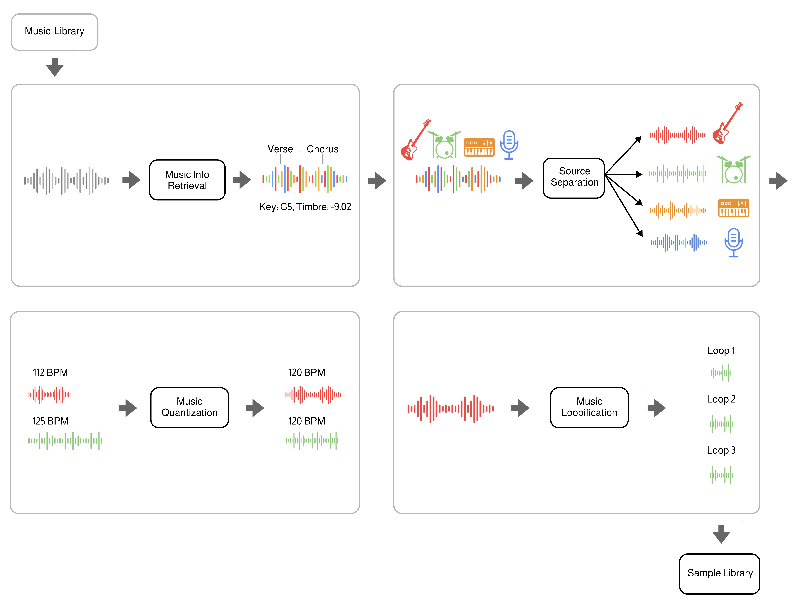

# Polymath

Polymath uses machine learning to convert any music library (*e.g from Hard-Drive or YouTube*) into a music production sample-library. The tool automatically separates tracks into stems (_drums, bass, etc._), quantizes them to the same tempo and beat-grid (*e.g. 120bpm*), analyzes tempo, key (_e.g C4, E3, etc._) and other infos (*timbre, loudness, etc.*) and cuts loop out of them. The result is a searchable sample library that streamlines the workflow for music producers, DJs, and ML audio developers.

Try it in colab:
<a target="_blank" href="https://colab.research.google.com/drive/1TjRVFdh1BPdQ_5_PL5EsfS278-EUYt90?usp=sharing">

</a>



## Use-cases

Polymath makes it effortless to combine elements from different tracks to create unique new compositions: Simply grab a beat from a Funkadelic track, a bassline from a Tito Puente piece, and fitting horns from a Fela Kuti song, and seamlessly integrate them into your DAW in record time. Using Polymath's search capability to discover related tracks, it is a breeze to create a polished, hour-long mash-up DJ set. For ML developers, Polymath simplifies the process of creating a large music dataset, for training generative models, etc.

## How does it work?

- Import tracks from youtube or directly from your google drive
- Process selected (or all) tracks with a configurable selection of nendo plugins:
    - Apply the [classification plugin](https://github.com/okio-ai/nendo-plugin-classify-core) to compute _volume_, _tempo_ (bpm), _key_, _intensity_, _frequency_, and _loudness_ for each track
    - Apply the [stemification plugin](https://github.com/okio-ai/nendo-plugin-stemify-demucs) to separate each track into four source signals: _vocals_, _drum_, _bass_, and _other_
    - Apply the [quantization plugin](https://github.com/okio-ai/nendo-plugin-quantize-core) to quantize each track to a specified target _bpm_
    - Apply the [loopification plugin](https://github.com/okio-ai/nendo-plugin-loopify) to automatically detect and extract loops from each sample
- Export the results of the processing with informative file names to your google drive in _wav_, _mp3_ or _ogg_ format.

## Community

Join the Polymath Community on [Discord](https://discord.gg/gaZMZKzScj)

## Requirements

**Polymath requires Python version 3.8, 3.9 or 3.10.**

> It is recommended to use a [virtual environment](https://docs.python.org/3/library/venv.html), in order to avoid dependency conflicts. You can use your favorite virtual environment management system, like [conda](https://docs.conda.io/en/latest/), [poetry](https://python-poetry.org/), or [pyenv](https://github.com/pyenv/pyenv) for example.

Furthermore, the following software packages need to be installed in your system:

- **Ubuntu**: `sudo apt-get install ffmpeg libsndfile1 libportaudio2 rubberband-cli libmpg123-dev`
- **Mac OS**: `brew install ffmpeg libsndfile portaudio rubberband mpg123`
- **Windows**

    > Windows support is currently under development. For the time being, we highly recommend using [Windows Subsystem for Linux](https://learn.microsoft.com/en-us/windows/wsl/install) and then following the linux instructions.

## Installation

You need python version `>=3.8` and `<=3.10`. From your terminal run:

```bash
git clone https://github.com/samim23/polymath
cd polymath
pip install -r requirements.txt
pip uninstall -y essentia essentia-tensorflow && pip install essentia-tensorflow
```

The last line is a fix that's needed to avoid a dependency conflict among the plugins.

## GPU support

Most of the libraries polymath uses come with native GPU support through cuda. Please follow the steps on https://www.tensorflow.org/install/pip to setup tensorflow for use with cuda. If you have followed these steps, tensorflow and torch will both automatically pick up the GPU and use it. This only applied to native setups, for dockerized deployments (see next section), gpu support is forthcoming

## Docker setup

If you have [Docker](https://www.docker.com/) installed on your system, you can use the provided `Dockerfile` to quickly build a polymath docker image (if your user is not part of the `docker` group, remember to prepend `sudo` to the following command):

```bash
docker build -t polymath ./
```

In order to exchange input and output files between your hosts system and the polymath docker container, you need to create the following four directories:

- `./polymath_input`
- `./polymath_library`
- `./polymath_output`
- `./models`

E.g. run `mkdir -p ./polymath_input ./polymath_library ./polymath_output ./models`.

Now put any files you want to process with polymath into the `polymath_input` folder.
Then you can run polymath through docker by using the `docker run` command and pass any arguments that you would originally pass to the python command, e.g. if you are in a linux OS call:

```bash
docker run \
    -v "$(pwd)"/models:/polymath/models \
    -v "$(pwd)"/polymath_input:/polymath/polymath_input \
    -v "$(pwd)"/polymath_library:/polymath/polymath_library \
    -v "$(pwd)"/polymath_output:/polymath/polymath_output \
    polymath \
    python polymath.py -i ./polymath_input/song1.wav -p -e
```

## Run Polymath

To print the help for the python command line arguments:

```bash
python polymath.py -h
```

### 1. Add tracks to the Polymath Library

##### Add YouTube video to library (auto-download)

```bash
python polymath.py -i n6DAqMFe97E
```

##### Add audio file (wav or mp3)

```bash
python polymath.py -i /path/to/audiolib/song.wav
```

##### Add multiple files at once

```bash
python polymath.py -i n6DAqMFe97E,eaPzCHEQExs,RijB8wnJCN0
python polymath.py -i /path/to/audiolib/song1.wav,/path/to/audiolib/song2.wav
python polymath.py -i /path/to/audiolib/
# you can even mix imports:
python polymath.py -i /path/to/audiolib/,n6DAqMFe97E,/path/to/song2.wav
```

Once in the database, they can be searched through, processed and exported. The database is stored by default in the folder "./polymath_library". To change the library folder use the `--library_path` console argument. To reset everything, simply delete that directory.

### 2. Quantize tracks in the Polymath Library

##### Find a specific song in the library and quantize it to tempo 120 BPM (-f = find ID in library, -q = quantize to tempo in BPM)

```bash
python polymath.py -f n6DAqMFe97E -q 120
```

##### Quantize all tracks in the library to tempo 120 BPM

```bash
python polymath.py -q 120
```

### 3. Search for specific tracks in the Polymath Library

##### Find tracks with specific search keys in the library and export them

```bash
python polymath.py -f n6DAqMFe97E,my_song.mp3 -e
```

The default export directory is `./polymath_output`. To specify a different directory, use the `-o /path/to/my/output/dir` flag.

##### Find tracks in specific BPM range as search criteria (-bmin and -bmax) and also export loops (-fl)

```bash
python polymath.py -bmin 80 -bmax 100 -fl -e
```

## Audio Features

### Extracted Stems

Stems are extracted with the [nendo stemify plugin](https://github.com/okio-ai/nendo_plugin_stemify_demucs/). Extracted stem types are:

```bash
- bass
- drum
- vocals
- other
```

### Extracted Features

Music Information Retrieval features are computed using the [nendo classify plugin](https://github.com/okio-ai/nendo_plugin_classify_core/). Extracted features are:

```bash
- tempo
- duration
- intensity
- avg_volume
- loudness
- frequency
- key
```

## License

Polymath is released under the MIT license as found in the [LICENSE](https://github.com/samim23/polymath/blob/main/LICENSE) file.

As for [nendo core](https://github.com/okio-ai/nendo) and the [plugins used in polymath](#how-does-it-work), see their respective repositories for information about their license.